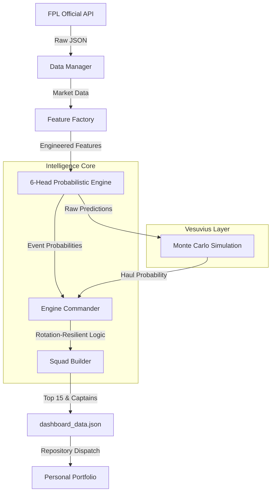

# FPL Predictor System Specification

The FPL Predictor is a high-performance, automated intelligence engine designed to master Fantasy Premier League through probabilistic forecasting and self-stabilizing reinforcement learning.

## 1. System Architecture

The engine follows a modular, three-layer architecture:

- **Data Layer**: Ingests raw data from the official FPL API and live match event feeds.
- **Intelligence Layer ("The Brain")**: A 6-head specialized XGBoost system that decomposes player performance into discrete probabilistic events.
- **Presentation Layer**: A Next.js dashboard hosted on Cloudflare, synced via a cross-repository CI/CD pipeline.

### High-Level Flow

---

## 2. The 6-Head Probabilistic Engine

Unlike traditional models that predict "total points" directly (which are high-variance), this engine predicts **individual event outcomes** using specialized heads.

### Core Targets
1. **Goals head**: Poisson regression for scoring probability.
2. **Assists head**: Poisson regression for playmaking probability.
3. **Clean Sheets head**: Logistic regression for defensive viability.
4. **Saves head**: Poisson regression for goalkeeper point floors.
5. **Bonus points head**: Probabilistic ranking based on historical BPS efficiency.
6. **Defcon head**: A specialized risk head predicting defensive contribution points.

### Vesuvius Simulation Layer
The engine adds a secondary simulation layer to predict **Double-Digit Hauls (11+ points)**.
- **Algorithm**: Monte Carlo simulation using Poisson (goals/assists) and Binomial (clean sheets) distributions.
- **Simulation Count**: 1,500 iterations per player.
- **Brave Mode Leak**: 50% of the simulation-based Matchup Boost (targeting leaky defenses) is leaked back into core **xP** to influence Starting XI selection.
- **Brave Score (Captaincy)**: Captain candidates are ranked using a `70/30` blend of Mean xP and Haul Probability.
- **Haul Alert**: A `haul_alert: true` flag is triggered when the simulated probability of $\geq 11$ points exceeds **20%**.

### Intelligence Features
- **Seasonal Actuals**: Dynamic tracking of a player's current season form vs. historical baseline.
- **Clinicality Index**: Measures goal conversion efficiency relative to expected threat.
- **FDR-Relative Weighting**: Adjusts feature importance based on upcoming fixture difficulty.

---

## 4. Squad Selection & Eligibility Strategy

The engine prioritizes **predictive reliability** over raw potential. A player must pass a series of "Hard Availability" gates to be considered for the Starting XI.

### Participation & Availability Assumptions
1. **The 2/3 Rule (Rotation Resilience)**:
   - To counteract mid-season rotation (e.g., December/January festive fixtures), the engine considers a player "starting material" if they have played **75+ minutes in at least 2 of the last 3 games**.
   - This allows the model to absorb a single "rest day" without benching a fit star player.

2. **Talisman Protection (Elite Asset Resilience)**:
   - Established stars (Ownership > 20% or >3 Season Hauls) who average >75 minutes over 5 games are granted a more lenient gate: **45+ minutes in 2 of the last 3**.
   - This protects against tactical substitutions (e.g., subbed off at 60 mins) while keeping them in the Starting XI if their xP is high.

3. **Binary Availability**:
   - Fitness and FPL-reported "Chance of Playing" (must be 100% or None) are strictly mandatory. No player with a yellow/red flag is ever recommended for the Starting XI.

4. **Zero-Scaling Policy**:
   - The engine does NOT scale Expected Points (xP) by predicted minutes. If a player is deemed a starter, they receive their **full potential projected score**. We assume players either start or are rested entirely.

---

## 3. Stability Sentinel (Self-Improvement)

The system features a self-correcting feedback loop that evaluates its own performance weekly and updates its confidence scores.

### Noise Gate & A/B Tracking
Reduces the global learning rate (`effective_lr`) during "chaotic" gameweeks where the Mean Absolute Error (MAE) exceeds historical norms.
- **A/B Metric Logging**: `trainer.py` now logs Mean Absolute Error (MAE) for both `xp_conservative` and `xp_brave`, allowing empirical comparison of the "Brave" strategy performance.

## Data Retention & History

The system maintains a **Stateless JSON Database** in the frontend public directory:
- **Snapshots**: Every `generate_static.py` run archives a full `gw_{id}.json` in `public/history/`.
- **Discovery**: A `metadata.json` tracks available gameweeks.
- **Frontend Switcher**: The UI allows toggle between "Live" and historical predictions, enabling retrospective analysis of model performance.

### Hysteresis (Trust Momentum)
Uses an Exponential Moving Average (EMA) for updating model confidence scores. The engine requires **sustained accuracy** over multiple weeks to increase trust in a specific model head.

### Squad Accuracy Filter (7/11 Rule)
The system tracks the "Hit Rate" of its top 11 recommendations. If the model fails to predict the viability of at least 60% of the suggested squad, it triggers a defensive learning mode to find feature drift.

---

## 4. Automation & Deployment

### Virtual Loop
The system lives in GitHub Actions and executes on a **12-hour heartbeat**.

1. **Deadline Sentinel**: Checks the `deadline_history.json`. It triggers a full refresh if:
   - Today is exactly **2 days before** a deadline.
   - The FPL API reports a **change in deadline time** (handling rescheduling).
2. **Validation**: Before any data is pushed, `validate_deployment.py` runs a series of health checks (schema validation, sanity ranges).
3. **Cross-Repo Sync**: On successful validation, the engine pushes `dashboard_data.json` and triggers a `repository_dispatch` to the portfolio repository for live deployment.
