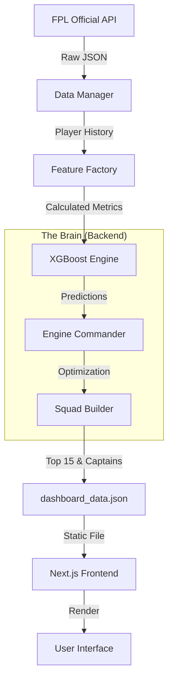

# Technical Architecture

## System Overview
The FPL Predictor is a modular, data-driven system designed to automate Fantasy Premier League decisions. It is composed of three distinct layers:

1.  **Data Layer**: Ingests raw data from the official FPL API.
2.  **Intelligence Layer ("The Brain")**: Processes features and runs XGBoost predictions.
3.  **Presentation Layer**: A Next.js frontend that displays the results.

## System Diagram


## The "Virtual Loop" (Automation)
The system is designed to be self-sustaining. It lives on GitHub and wakes up once a day to refresh its own brain.

1.  **Trigger**: GitHub Actions (`cron: '0 3 * * *'`) wakes the system daily at 3 AM UTC.
2.  **Environment**: A Linux environment is spun up with Python 3.10.
3.  **Execution**: `backend/generate_static.py` runs the pipeline.
    - If it's a deadline day (or forced), it pulls fresh data.
    - It recalculates all metrics (Explosivity, Defcon).
    - It writes a new `dashboard_data.json`.
4.  **Commit**: The Action commits this JSON file back to the repository.
5.  **Push**: The changes are pushed to `main`.

## Directory Structure
```
├── backend/
│   ├── engine/           # Core logic modules
│   │   ├── commander.py  # Orchestrates the logic
│   │   ├── trainer.py    # XGBoost model wrapper
│   │   └── ...
│   ├── data/             # Local storage for training data
│   └── generate_static.py # Entry point for automation
├── frontend/             # Next.js web application
└── .github/workflows/    # Automation configurations
```

## Portfolio Integration Strategy
**Problem**: This project lives in a separate repository (`fantasy-premier-league`) from your main portfolio (`chris-website`), but needs to be accessible at `chriseyebagha.com/fantasy`.

**Solution: The Build Trigger Pattern**
Since `chriseyebagha.com` is hosted on Cloudflare Pages (or similar), it needs to know when *this* project updates.

1.  **Separate Repositories**: Keep them separate to maintain clean history and distinct concerns.
2.  **The Trigger**: We add a step to this project's GitHub Action that sends a `repository_dispatch` event to your main website's repository.
3.  **The Result**:
    - `fantasy-premier-league` updates its data.
    - It pings `chris-website` saying "I changed!".
    - `chris-website` rebuilds, pulling the latest `dashboard_data.json` (or rebuilding the submodule if you use that approach).
    - Cloudflare deploys the updated site.

This ensures that a change in *either* repo triggers a live update, fulfilling the seamless integration requirement.
