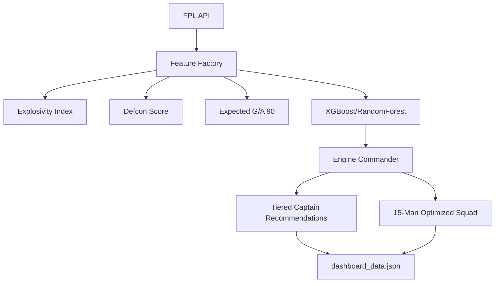

# FPL Predictor: Technical Specification

## System Architecture

The FPL Predictor is a decoupled analytics engine designed to transform raw Premier League data into actionable transfer and captaincy insights.

## 1. Predictive Modeling
The core of the system is a machine learning model (XGBoost with a RandomForest fallback) trained on historical gameweek data.

- **Target Variable**: `total_points` for the upcoming gameweek.
- **Features**: ICT Index, Form, Value, xG/xA per 90, Fixture Difficulty (FDR), and Historical Volatility.
- **Handling Outliers**: The model recognizes "Elite" status through the Explosivity Index to prevent over-penalizing high-ceiling assets during hard fixtures.

## 2. Advanced Metrics

### Explosivity Index (0 - 100)
A proprietary metric measuring a player's ceiling rather than their floor.
- **Base**: Weighted historical performance volatility.
- **Bonus**:
    - `+15`: Form >= 7.5.
    - `+15`: xGI per 90 >= 0.70.
    - `+20`: Global "Haul" count (10+ point Gs) >= 5.
- **Capping**: Scaled to a max of 100 for normalization across positions.

### Defcon Score
Used primarily for GKs and DEFs to measure clean sheet probability combined with offensive threat.
- **Inputs**: Team defensive strength + individual xGI + Fixture difficulty.
- **Scaling**: A high Defcon (>70) indicates a player has both high Clean Sheet security and meaningful offensive συμμετοχή (participation).

## 3. Selection Logic (The Engine Commander)

### The Optimized Squad
The algorithm selects a 15-man squad within a £100.0m budget (adjustable) using a greedy optimization approach:
1.  **Value Score**: Calculates `Predicted Points / Cost`.
2.  **Position Constraints**: Strictly adheres to 2 GKs, 5 DEFs, 5 MIDs, 3 FWDs.
3.  **Elite Pass**: High-value assets (e.g., Salah, Haaland) are prioritized if their Explosivity is >= 70, even if their "Value Score" is lower, recognizing that "Fixture-Proof" status overrides raw ROI.

### Tiered Captain Recommendations
Players are categorized into four tactical tiers:
- **The Easy Choice**: High Ownership (>25%) + High reliability (Haul count > 4).
- **The Obvious**: Pure mathematical ceiling based on highest predicted points.
- **The Joker**: Low ownership differentials (<15%) with high Explosivity Index.
- **The Fun One**: Defensive assets with the highest Defcon scores (attacking defenders).

## 4. Automation & Pipeline
The engine is updated daily via **GitHub Actions** (`update_fpl.yml`):
- **Schedule**: `0 3 * * *` (3 AM UTC).
- **Execution**: 
    - Scrapes FPL API.
    - Re-calculates features for every active player.
    - Updates `dashboard_data.json`.
    - Pushes updates to the repository, triggering the frontend re-build.
